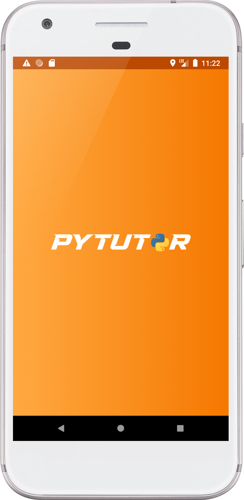
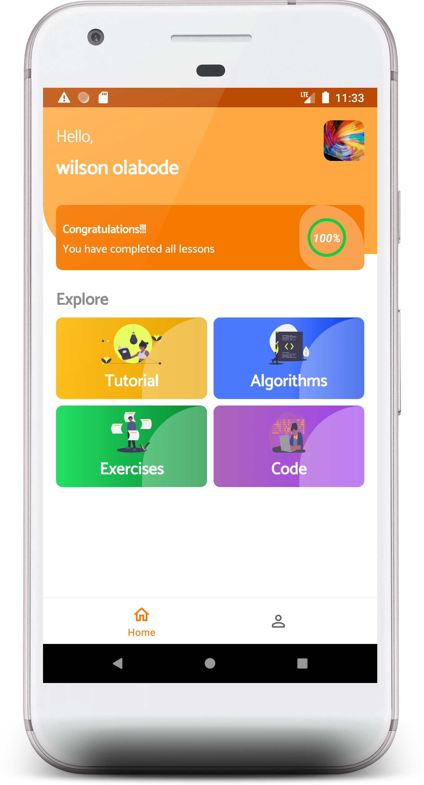
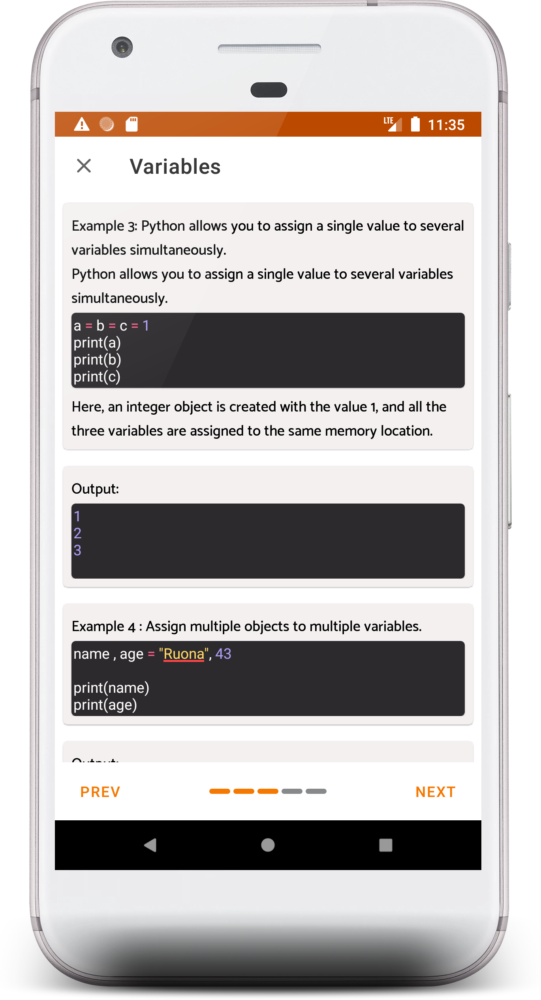
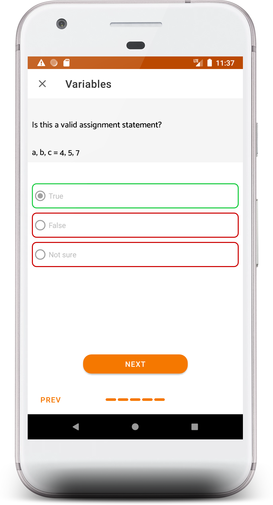
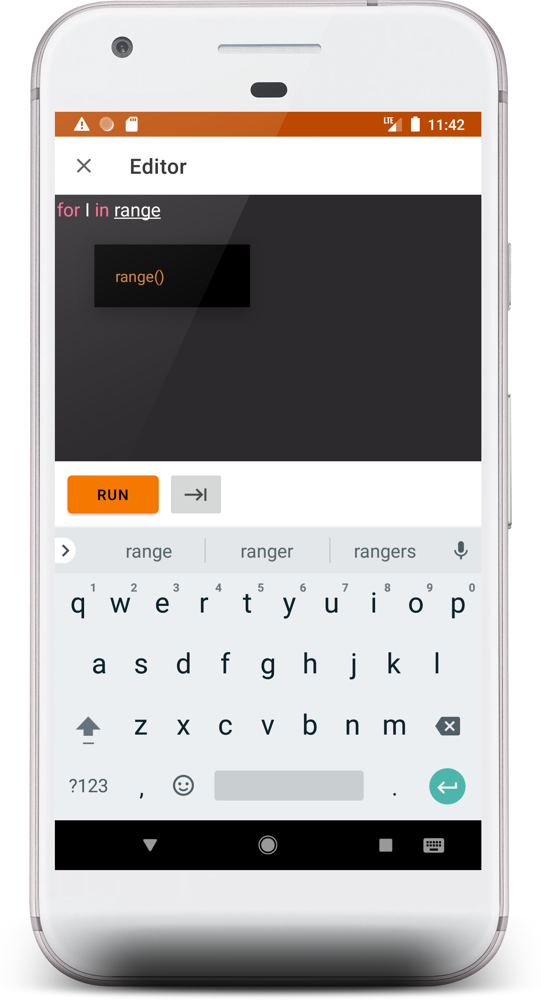

# **PyTutor** 
Learn the fundamentals of the Python programming language from your smartphone, anytime at your own pace and on the go with PyTutor.PyTutor provides users with :

* In-depth lessons with quizzes.Exercises and solutions of varying difficulties.
* Common algorithms and their explanations.
* A built-in Python interpreter (only available on Android Marshmallow and above).
* A very simple and intuitive user interface

Features:
- Tutorials
- Exercises
- Quiz
- Interpreter

min sdk 21

 

